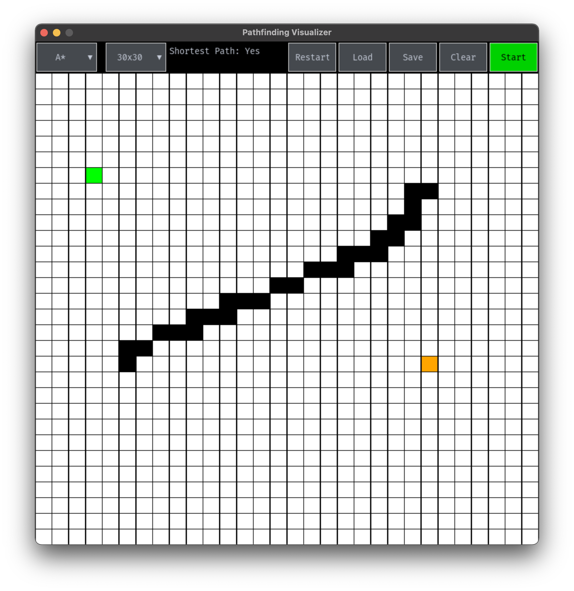

# Path Finding Visualizer

Visualize path finding algorithms in action. Written in Python using Pygame.

## Algorithms Supported

- A* Search
- Dijkstra's Algorithm
- Breadth First Search
- Depth First Search

## Setup

- Clone the repository
- Install the dependencies using `pip install -r requirements.txt`
- Run `python3 main.py --help` to see the options

## Usage

- Run `python3 main.py -mode gui` to run the GUI
- Run `python3 main.py -mode cli` to run the CLI
- Run `python3 main.py -random [n]` to generate a random maze of size n x n with random start and end points and walls

## Screenshots

## GUI Controls

- Left click to add start point and end point
- Left click and drag to add or remove walls 
- Press enter to start the algorithm
- Press `s` to save the maze
- Press `l` to load a maze
- Press `r` to reset the algorithm
- Press `c` to clear the maze
- Press `q` to quit

